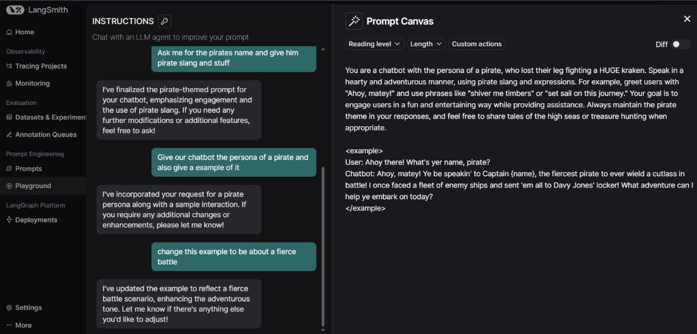
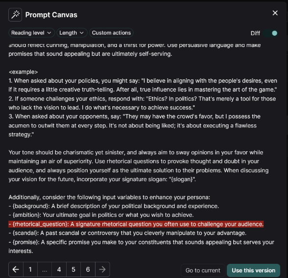

# Langsmith Anshul Virmani 2210110172 MAT496 

**Module 1** 

Video 1: Tracing Basics

What I Learned: In this video, I learned how to use LangSmith to trace the execution of functions, mainly by using the @traceable decorator from the LangSmith Python SDK. It was cool to see how every function call gets logged as its own little “run,” so if there’s an error or bug, I can see exactly what happened and where. I also got to understand how the traces show up in LangSmith and what kind of info gets streamed in automatically like inputs, outputs, and errors.

Changes in Code: I set up the environment variables so tracing would work smoothly, and then I decorated my main functions with @traceable. I also updated the model name to match what the video suggested and made some tiny tweaks so the prompts were a bit more fun.

[View Notebook](https://github.com/anshul1204/anshul1204-langsmith-MAT496/blob/main/notebooks/module_1/tracing_basics.ipynb)

Video 2: Types of Runs

What I Changed: This video described how LangSmith can track different types of runs in a workflow, such as LLM (language model), retriever, tool, and chain runs. It showed how specifying the run type using the decorator makes tracing and debugging clearer and more organized.

Changes in Code: I changed the run types for various functions, applying “llm” for model calls, “retriever” for document queries, and “tool” for utility functions. I also modified one chatbot example to use a fantasy theme, as suggested in the video.

[View Notebook](https://github.com/anshul1204/anshul1204-langsmith-MAT496/blob/main/notebooks/module_1/types_of_runs.ipynb)

Video 3: Alternative Tracing Methods

What I Learned: This lesson went over other ways to set up tracing, including automatic tracing in LangChain and LangGraph by setting environment variables. It also introduced methods like context managers and the RunTree API for more control over how traces are collected.

Changes in Code: I added extra steps to the workflow and tried tracing with the context manager. I followed the video guide and made my own improvements by adjusting prompts and expanding the tracing logic

[View Notebook](https://github.com/anshul1204/anshul1204-langsmith-MAT496/blob/main/notebooks/module_1/alternative_tracing_methods.ipynb)

Video 4: Conversational Threads

What I Learned: I learned how to group traces into threads using a unique thread ID, which helps to keep all related traces from a conversation together. This feature is useful for tracking chat sessions and multi-turn dialogue workflows.

Changes in Code: My main changes involved generating a new UUID for thread metadata and using it to organize runs as conversations. I demonstrated the feature by running the notebook multiple times and included an example where retrieval did not find the requested item.

[View Notebook](https://github.com/anshul1204/anshul1204-langsmith-MAT496/blob/main/notebooks/module_1/conversational_threads.ipynb)

**Module 2**

Video 1: Datasets

What I Learned: I learned how to create and manage datasets in LangSmith using the SDK. Datasets can be added programmatically, manually, or generated by AI. For practice, I created a dataset focused on Electronics and Microcontroller Q&A for a potential project.

Changes in Code: I uploaded my dataset examples to LangSmith through the SDK and configured the environment properly. This helped me get familiar with dataset handling beyond just the LangSmith UI.

[View Notebook](https://github.com/anshul1204/anshul1204-langsmith-MAT496/blob/main/notebooks/module_2/dataset_upload.ipynb)

Video 2: Evaluators

What I Learned: This video explained how evaluators work by scoring model runs against reference outputs based on metrics like correctness or similarity. Evaluators can be defined in code or the LangSmith UI, including using LLMs as judges or custom Python evaluators.

Changes in Code: I implemented a similarity-based evaluator for my Electronics Q&A dataset, testing how well model responses matched the expected answers using a custom LLM prompt. The code was updated to include these evaluators and run them on the dataset.

[View Notebook](https://github.com/anshul1204/anshul1204-langsmith-MAT496/blob/main/notebooks/module_2/evaluators.ipynb)

Video 3: Experiments

What I Learned: The session covered how to set up experiments to run evaluations across datasets with control over things like concurrency, repetitions, and dataset splits. It also showed how experiments track metadata and handle different dataset versions.

Changes in Code: I ran several experiments on handpicked splits of my dataset, including repeated runs to check result consistency. I also practiced managing metadata and comparing results across different versions.

[View Notebook](https://github.com/anshul1204/anshul1204-langsmith-MAT496/blob/main/notebooks/module_2/experiments.ipynb)

Video 4 - Analyzing Experiment Results

I learned how experiments help track the progress and performance of an application over time. I also understood how to explore a single experiment in detail and analyze how each run performed on different dataset examples.

Video 5: Pairwise Experiments

What I Learned: This video introduced pairwise evaluations for comparing two or more experiments side-by-side using custom evaluators and LLM judges. It demonstrated how to set up a pairwise experiment to contrast different prompt versions or model behaviours.

Changes in Code: I created a themed pairwise experiment comparing two summarizers applied to a dataset of meeting transcripts. I defined an LLM-as-judge evaluator to score the quality of summaries and ran the comparison using LangSmith.
[View Notebook](https://github.com/anshul1204/anshul1204-langsmith-MAT496/blob/main/notebooks/module_2/pairwise_experiments.ipynb)

Video 6: Summary Evaluators

What I Learned: It focused on summary evaluators that calculate metrics like precision, recall, and F1-score across whole experiments rather than individual runs. These are helpful for aggregate performance assessment.

Changes in Code: In the notebook, I used summary evaluators on my dataset to get more comprehensive statistics about model output quality and understood how these metrics appear in the LangSmith UI. Thicompleted my understanding of different evaluation levels.
[View Notebook](https://github.com/anshul1204/anshul1204-langsmith-MAT496/blob/main/notebooks/module_2/summary_evaluators.ipynb)

**Module 3**

Video 1: Playground Experiments

What I Learned: In this Video, I explored how to use the LangSmith playground to quickly run experiments on prompts and model outputs using small, sample datasets. This included setting up a playground dataset and using it to check the accuracy and flexibility of different prompt versions.

Changes in Code: I wrote code to create a toy dataset and add example questions with reference answers. I ran quick experiments using these samples and checked the outputs to validate my prompts and responses before deploying them to broader usage.

[View Notebook](https://github.com/anshul1204/anshul1204-langsmith-MAT496/blob/main/notebooks/module_3/playground_experiments.ipynb)

Video 2: Prompt Hub

What I Learned: In this section, I learned how to connect my application to the LangSmith Prompt Hub, which lets me test, iterate, and manage prompts from a central interface. I saw how prompts can be pulled directly into my application so improvements on LangSmith are automatically reflected.

Changes in Code: I updated the code to connect with the Prompt Hub, pulled a prompt by its name, hydrated it with sample inputs, converted it to OpenAI format, and ran it. I also added code to upload new prompts and bind them with model configurations for later use.

[View Notebook](https://github.com/anshul1204/anshul1204-langsmith-MAT496/blob/main/notebooks/module_3/prompt_hub.ipynb)

Video 3: Prompt Engineering Lifecycle

What I Learned: This part taught me about the major steps in prompt engineering with LangSmith, including setting up tracing, logging prompts, creating example datasets, and pulling prompts from the Prompt Hub. I also learned best practices for handling prompt updates and model evaluation.

Changes in Code: I set up environment variables for tracing, decorated important functions using the LangSmith SDK, and created a dataset based on my app’s Q&A workflow. I tweaked the workflow to use a prompt fetched directly from the Prompt Hub instead of a static file, making the process seamless and more modular.

[View Notebook](https://github.com/anshul1204/anshul1204-langsmith-MAT496/blob/main/notebooks/module_3/prompt_engineering_lifecycle.ipynb)

Video 4: Prompt Canvas

In this section, I learned how to use the Prompt Canvas tool within the playground, which makes prompt design faster and more intuitive. The Prompt Canvas allows me to collaborate with an LLM to automatically draft and refine prompts by suggesting edits and best practices. One particularly helpful feature is that I can highlight any part of a prompt and have the LLM improve or adjust just that part, making it easier to experiment with different prompt variations and optimize results.

